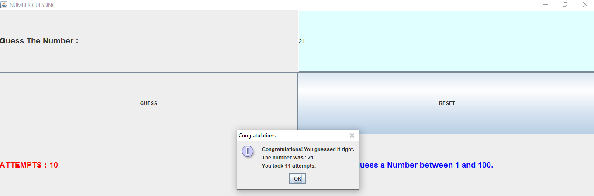

# Number Guessing Game

This is a simple Number Guessing game implemented in Java.

## How to Play

1. Clone the repository to your local machine.
2. Navigate to the project directory.
3. Compile the Java files using `javac NumberGuessing.java`
4. Run the game using `java NumberGuessing`

## Features

- The game generates a random number between the specified range of 1 to 100.
- The player has to guess the number.
- After each guess, the game provides feedback on whether the guess is too high, too low, or correct.

## Files

- `NumberGuessing.java`: Main class containing the Game logic.
- `NumberGuessing.jar` : Compiled JAR file containing this Game.

## Screenshots

